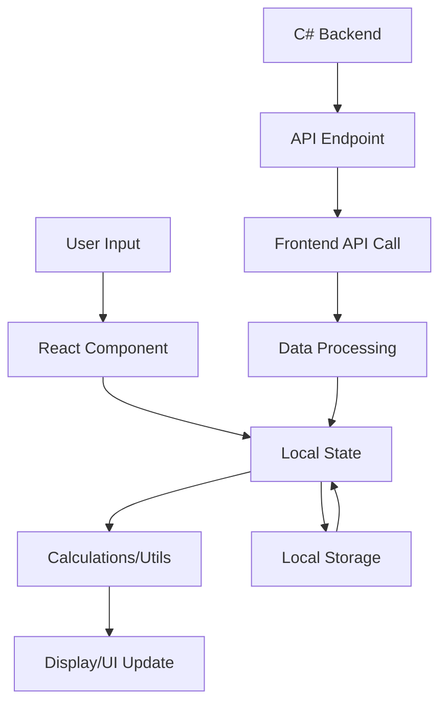

# Software Requirements Specification (SRS)
## CS2 Analytics Pro - Betting Analytics Dashboard

**Document Version:** 1.0  
**Date:** October 7, 2025  
**Project:** CS2 Analytics Pro  
**Repository:** https://github.com/Vasil-Sh/CS.git

---

## 1. Project Overview and Scope

### 1.1 Project Description
CS2 Analytics Pro is a comprehensive web-based betting analytics dashboard specifically designed for Counter-Strike 2 (CS2) esports betting. The application provides advanced analytics, risk management tools, team performance analysis, and betting tracking capabilities to help users make informed betting decisions.

### 1.2 Project Goals
- **Primary Goal:** Provide comprehensive betting analytics and risk management for CS2 esports
- **Secondary Goal:** Enable data-driven betting decisions through advanced team and match analysis
- **Tertiary Goal:** Offer intuitive user interface for both novice and experienced bettors

### 1.3 Scope
**In Scope:**
- Betting analytics and performance tracking
- Team analysis and performance metrics
- Match data visualization and insights
- Risk management calculations (Sharpe ratio, Kelly criterion)
- User betting history and portfolio management
- Real-time data integration with C# backend
- Responsive web interface for desktop and mobile

**Out of Scope:**
- Direct betting placement functionality
- Payment processing
- Live streaming integration
- Mobile native applications (iOS/Android)

### 1.4 Target Users
- **Primary:** CS2 esports betting enthusiasts
- **Secondary:** Professional esports analysts
- **Tertiary:** Casual gamers interested in CS2 statistics

---

## 2. Functional Requirements

### 2.1 Analytics Module (FR-001)
**Priority:** P0 (Must-have)

**Description:** Comprehensive betting analytics dashboard providing performance metrics and insights.

**Features:**
- Portfolio performance tracking with profit/loss calculations
- ROI (Return on Investment) analysis with visual charts
- Betting volume and frequency analytics
- Win rate calculations and trend analysis
- Risk-adjusted returns using Sharpe ratio
- Kelly criterion for optimal bet sizing
- Data export functionality (CSV, PDF)
- Clear data functionality for resetting analytics

**Acceptance Criteria:**
- Display current balance, total profit/loss, and ROI
- Show betting statistics with at least 7 key metrics
- Provide visual charts for performance trends
- Calculate and display risk management indicators
- Allow users to clear all betting data
- Handle empty data states gracefully

### 2.2 Team Analysis Module (FR-002)
**Priority:** P0 (Must-have)

**Description:** Advanced team performance analysis with database integration.

**Features:**
- Team performance metrics and statistics
- Historical performance data visualization
- Team comparison tools
- Backend database connection status
- Team data loading from external database
- Performance trend analysis
- Team ranking and rating systems

**Acceptance Criteria:**
- Display comprehensive team statistics
- Show backend connection status with clear indicators
- Provide team data loading functionality
- Handle database connection errors gracefully
- Display team performance trends with charts
- Support team comparison features

### 2.3 Match Analysis Module (FR-003)
**Priority:** P1 (Should-have)

**Description:** Match data analysis and betting opportunity identification.

**Features:**
- Upcoming match listings
- Historical match results
- Match statistics and analytics
- Betting odds integration
- Match prediction algorithms
- Head-to-head team comparisons

**Acceptance Criteria:**
- Display upcoming and past matches
- Show match statistics and key metrics
- Provide betting odds information
- Calculate match predictions based on team data
- Support filtering and sorting of matches

### 2.4 Betting Portfolio Module (FR-004)
**Priority:** P0 (Must-have)

**Description:** Personal betting history and portfolio management.

**Features:**
- Betting history tracking
- Individual bet performance analysis
- Portfolio diversification metrics
- Bet categorization and tagging
- Performance comparison across different bet types
- Betting pattern analysis

**Acceptance Criteria:**
- Track all user betting activities
- Display detailed bet information
- Calculate individual bet ROI
- Provide portfolio performance metrics
- Support bet categorization and filtering

### 2.5 Risk Management Module (FR-005)
**Priority:** P0 (Must-have)

**Description:** Advanced risk analysis and management tools.

**Features:**
- Sharpe ratio calculations
- Kelly criterion for bet sizing
- Value at Risk (VaR) calculations
- Drawdown analysis
- Risk-adjusted performance metrics
- Portfolio risk assessment

**Acceptance Criteria:**
- Calculate accurate Sharpe ratios
- Provide Kelly criterion recommendations
- Display risk metrics with explanations
- Handle edge cases (zero variance, negative returns)
- Provide risk level categorization

### 2.6 Dashboard Module (FR-006)
**Priority:** P1 (Should-have)

**Description:** Centralized overview of all key metrics and quick actions.

**Features:**
- Key performance indicators (KPIs) overview
- Quick access to major functions
- Recent activity summary
- Alert and notification center
- Customizable widget layout

**Acceptance Criteria:**
- Display top 5-7 key metrics
- Provide navigation shortcuts
- Show recent betting activity
- Support widget customization
- Load quickly with minimal data

---

## 3. Non-Functional Requirements

### 3.1 Performance Requirements (NFR-001)
- **Page Load Time:** < 3 seconds for initial load
- **Response Time:** < 1 second for user interactions
- **Data Processing:** Handle up to 10,000 betting records efficiently
- **Concurrent Users:** Support up to 100 simultaneous users

### 3.2 Usability Requirements (NFR-002)
- **Responsive Design:** Support desktop (1920x1080+), tablet (768px+), and mobile (320px+)
- **Accessibility:** WCAG 2.1 AA compliance
- **Browser Support:** Chrome 90+, Firefox 88+, Safari 14+, Edge 90+
- **Learning Curve:** New users should complete basic tasks within 10 minutes

### 3.3 Reliability Requirements (NFR-003)
- **Uptime:** 99.5% availability
- **Error Handling:** Graceful degradation for backend failures
- **Data Integrity:** No data loss during normal operations
- **Recovery Time:** < 5 minutes for system recovery

### 3.4 Security Requirements (NFR-004)
- **Data Protection:** Encrypt sensitive user data
- **Authentication:** Secure user authentication (if implemented)
- **Input Validation:** Sanitize all user inputs
- **HTTPS:** Secure communication protocols

### 3.5 Maintainability Requirements (NFR-005)
- **Code Quality:** TypeScript strict mode compliance
- **Documentation:** Comprehensive inline code documentation
- **Testing:** Unit test coverage > 80%
- **Modularity:** Component-based architecture for easy maintenance

---

## 4. System Architecture Analysis

### 4.1 Frontend Architecture
```
┌─────────────────┐    ┌─────────────────┐    ┌─────────────────┐
│   Presentation  │    │    Business     │    │      Data       │
│     Layer       │    │     Logic       │    │     Layer       │
├─────────────────┤    ├─────────────────┤    ├─────────────────┤
│ • React Pages   │    │ • Hooks         │    │ • Local Storage │
│ • Components    │◄──►│ • Utils         │◄──►│ • API Calls     │
│ • UI Library    │    │ • Calculations  │    │ • State Mgmt    │
└─────────────────┘    └─────────────────┘    └─────────────────┘
```

### 4.2 Technology Stack
- **Frontend Framework:** React 18+ with TypeScript
- **Styling:** Tailwind CSS + Shadcn-ui components
- **Routing:** React Router v6
- **State Management:** React hooks (useState, useEffect)
- **Build Tool:** Vite
- **Package Manager:** npm/yarn
- **Version Control:** Git with GitHub

### 4.3 Component Architecture
```
App.tsx
├── Layout.tsx (Navigation + Sidebar)
├── Pages/
│   ├── Analytics.tsx
│   ├── Teams.tsx
│   ├── Matches.tsx
│   ├── MyBets.tsx
│   └── Dashboard.tsx
├── Components/
│   ├── RiskManagement.tsx
│   └── UI Components (Shadcn-ui)
└── Utils/
    ├── calculations.ts
    └── types.ts
```

---

## 5. User Interface Requirements

### 5.1 Navigation Requirements (UI-001)
- **Primary Navigation:** Fixed sidebar with 5 main sections
- **Navigation Items:** 
  - Аналітика (Analytics) - Target icon
  - Матчі (Matches) - Trophy icon
  - Аналіз команд (Team Analysis) - Users icon
  - Мої ставки (My Bets) - Wallet icon
  - Панель управління (Dashboard) - BarChart3 icon
- **Mobile Navigation:** Collapsible hamburger menu
- **Active State:** Visual indication of current page

### 5.2 Layout Requirements (UI-002)
- **Desktop Layout:** Fixed 288px (18rem) sidebar + main content area
- **Mobile Layout:** Full-width with collapsible navigation
- **Header:** Application title "CS2 Analytics Pro"
- **Content Area:** Responsive padding and spacing

### 5.3 Color Scheme and Branding (UI-003)
- **Primary Colors:** Blue (#3B82F6) for active states
- **Background:** Light gray (#F9FAFB) for main background
- **Text:** Gray scale (#374151, #6B7280, #9CA3AF)
- **Success:** Green for positive metrics
- **Error:** Red for negative metrics and alerts
- **Warning:** Yellow/Orange for caution states

### 5.4 Typography Requirements (UI-004)
- **Font Family:** System fonts (Inter, system-ui)
- **Headings:** Bold weights for section titles
- **Body Text:** Regular weight for content
- **Data Display:** Monospace for numerical data

---

## 6. Data Requirements and Flow

### 6.1 Data Models

#### 6.1.1 Betting Record
```typescript
interface BettingRecord {
  id: string;
  date: Date;
  match: string;
  team: string;
  amount: number;
  odds: number;
  result: 'win' | 'loss' | 'pending';
  profit: number;
  category: string;
}
```

#### 6.1.2 Team Data
```typescript
interface TeamData {
  id: string;
  name: string;
  rating: number;
  winRate: number;
  recentForm: number[];
  mapStats: MapStatistics[];
  playerStats: PlayerStatistics[];
}
```

#### 6.1.3 Match Data
```typescript
interface MatchData {
  id: string;
  date: Date;
  team1: string;
  team2: string;
  odds: {team1: number, team2: number};
  status: 'upcoming' | 'live' | 'completed';
  result?: MatchResult;
}
```

### 6.2 Data Flow Architecture


### 6.3 Data Storage Strategy
- **Local Storage:** User preferences, temporary data, offline capability
- **Session Storage:** Temporary calculations, form data
- **Backend Database:** Persistent team data, match history, user accounts
- **Cache Strategy:** Local caching for frequently accessed team/match data

---

## 7. Technology Stack Documentation

### 7.1 Frontend Dependencies
```json
{
  "react": "^18.0.0",
  "react-router-dom": "^6.0.0",
  "typescript": "^5.0.0",
  "tailwindcss": "^3.0.0",
  "lucide-react": "^0.263.0",
  "@radix-ui/react-*": "Various UI components",
  "class-variance-authority": "^0.7.0",
  "clsx": "^2.0.0",
  "tailwind-merge": "^1.14.0"
}
```

### 7.2 Development Tools
- **Build Tool:** Vite for fast development and building
- **TypeScript:** Strict mode for type safety
- **ESLint:** Code quality and consistency
- **Prettier:** Code formatting
- **Git:** Version control with conventional commits

### 7.3 UI Component Library
- **Shadcn-ui:** Modern, accessible React components
- **Radix UI:** Headless UI primitives
- **Lucide React:** Icon library
- **Tailwind CSS:** Utility-first CSS framework

---

## 8. Integration Requirements

### 8.1 C# Backend Integration (INT-001)
**Purpose:** Connect to existing C# application for team and match data

**Requirements:**
- RESTful API endpoints for data exchange
- JSON data format for communication
- Error handling for connection failures
- Authentication mechanism (if required)
- Real-time data updates capability

**API Endpoints:**
```
GET /api/teams - Retrieve team data
GET /api/matches - Retrieve match data
GET /api/teams/{id}/stats - Get specific team statistics
POST /api/connection/test - Test backend connectivity
```

### 8.2 Database Integration (INT-002)
**Purpose:** Persistent storage for team data, match history, and user information

**Requirements:**
- SQLite/SQL Server database support
- Data synchronization between frontend and backend
- Backup and recovery mechanisms
- Data migration capabilities
- Performance optimization for large datasets

### 8.3 External Data Sources (INT-003)
**Purpose:** Integration with esports data providers (future enhancement)

**Potential Integrations:**
- HLTV.org for team rankings and match data
- Steam API for player statistics
- Betting odds providers
- Live match data feeds

---

## 9. User Stories and Use Cases

### 9.1 Primary User Stories

#### US-001: Betting Performance Analysis
**As a** CS2 betting enthusiast  
**I want to** track my betting performance with detailed analytics  
**So that** I can improve my betting strategy and maximize profits

**Acceptance Criteria:**
- View current balance, total profit/loss, and ROI
- See detailed betting statistics and trends
- Access risk management calculations
- Export performance data

#### US-002: Team Research and Analysis
**As a** bettor researching teams  
**I want to** access comprehensive team statistics and performance data  
**So that** I can make informed betting decisions

**Acceptance Criteria:**
- View team performance metrics
- Compare multiple teams
- Access historical performance data
- See team form and recent results

#### US-003: Risk Management
**As a** responsible bettor  
**I want to** use advanced risk management tools  
**So that** I can protect my bankroll and optimize bet sizing

**Acceptance Criteria:**
- Calculate Sharpe ratios for performance evaluation
- Get Kelly criterion recommendations for bet sizing
- Monitor portfolio risk levels
- Receive risk alerts and warnings

#### US-004: Match Analysis
**As a** bettor looking for opportunities  
**I want to** analyze upcoming and past matches  
**So that** I can identify valuable betting opportunities

**Acceptance Criteria:**
- View upcoming match schedules
- Access match statistics and predictions
- Compare head-to-head team performance
- See betting odds and value analysis

#### US-005: Portfolio Management
**As a** active bettor  
**I want to** manage my betting portfolio and history  
**So that** I can track all my bets and analyze patterns

**Acceptance Criteria:**
- Record and categorize all bets
- View detailed betting history
- Analyze betting patterns and trends
- Calculate individual bet performance

### 9.2 Use Case Scenarios

#### Scenario 1: New User Onboarding
1. User opens CS2 Analytics Pro
2. System displays clean dashboard with sample data
3. User navigates through main sections
4. User adds first betting record
5. System updates analytics automatically

#### Scenario 2: Daily Betting Analysis
1. User opens Analytics page
2. System displays current performance metrics
3. User reviews recent betting activity
4. User checks risk management indicators
5. User makes betting decisions based on data

#### Scenario 3: Team Research Process
1. User navigates to Team Analysis page
2. System connects to backend database
3. User loads team data from database
4. User compares team statistics
5. User identifies betting opportunities

---

## 10. Acceptance Criteria

### 10.1 Functional Acceptance Criteria

#### Analytics Module
- ✅ Display current balance with proper formatting
- ✅ Calculate and show ROI with percentage
- ✅ Provide betting statistics (win rate, total bets, etc.)
- ✅ Include risk management calculations (Sharpe ratio, Kelly criterion)
- ✅ Handle empty data states gracefully
- ✅ Allow data clearing functionality
- ✅ Show visual charts for performance trends

#### Team Analysis Module
- ✅ Display backend connection status
- ✅ Provide team data loading functionality
- ✅ Show comprehensive team statistics
- ✅ Handle database connection errors
- ✅ Support team comparison features
- ✅ Display performance trends with charts

#### Navigation and Layout
- ✅ Responsive design for desktop and mobile
- ✅ Fixed sidebar navigation with proper icons
- ✅ Active page indication
- ✅ Mobile hamburger menu functionality
- ✅ Consistent styling across all pages

### 10.2 Technical Acceptance Criteria

#### Performance
- Page load times under 3 seconds
- Smooth user interactions without lag
- Efficient handling of large datasets
- Optimized bundle size for fast loading

#### Code Quality
- TypeScript strict mode compliance
- ESLint rules adherence
- Component modularity and reusability
- Proper error handling and user feedback

#### Browser Compatibility
- Chrome 90+ support
- Firefox 88+ support
- Safari 14+ support
- Edge 90+ support
- Mobile browser compatibility

### 10.3 User Experience Criteria

#### Usability
- Intuitive navigation structure
- Clear visual hierarchy
- Consistent design patterns
- Helpful error messages and feedback
- Accessible design (WCAG 2.1 AA)

#### Data Presentation
- Clear and readable data visualization
- Proper number formatting (currency, percentages)
- Meaningful charts and graphs
- Color-coded indicators for quick understanding
- Export functionality for important data

---

## 11. Constraints and Assumptions

### 11.1 Technical Constraints
- Must use React with TypeScript
- Must integrate with existing C# backend
- Limited to web-based solution (no native mobile apps)
- Must support offline functionality for basic features

### 11.2 Business Constraints
- No direct betting placement functionality
- No payment processing integration
- Must comply with gambling regulations in target markets
- Limited budget for external data sources

### 11.3 Assumptions
- Users have basic understanding of CS2 esports
- C# backend API will be available and stable
- Users will primarily access via desktop browsers
- Internet connection available for real-time data

---

## 12. Future Enhancements

### 12.1 Phase 2 Features
- Real-time match tracking and live betting analytics
- Advanced machine learning predictions
- Social features (sharing analyses, following other users)
- Mobile native applications (iOS/Android)

### 12.2 Phase 3 Features
- Integration with multiple esports titles
- Professional analyst tools and reports
- API for third-party integrations
- White-label solutions for betting operators

---

## 13. Glossary

**CS2:** Counter-Strike 2, the latest version of the popular tactical FPS game  
**ROI:** Return on Investment, a measure of betting profitability  
**Sharpe Ratio:** Risk-adjusted return metric  
**Kelly Criterion:** Mathematical formula for optimal bet sizing  
**HLTV:** Popular CS2 statistics and news website  
**Shadcn-ui:** Modern React component library  
**Tailwind CSS:** Utility-first CSS framework  

---

**Document End**

*This SRS document serves as the foundation for CS2 Analytics Pro development and maintenance. It should be updated as requirements evolve and new features are added.*